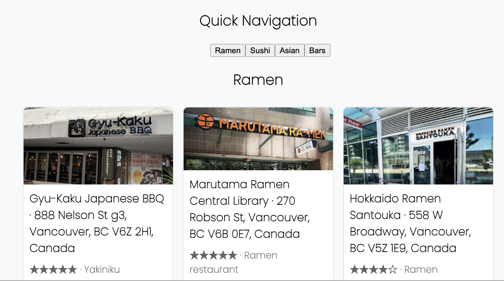

# Minimal Link Preview Rendering

This is a clean webpage that renders previews lists of links and google maps places.

## Key features

- Render link preview with images
- Jump to section navigation
- Render page with React's style component cards
- Responsive UI

Live demo: https://csb-91tckc.netlify.app/

Key library: https://www.npmjs.com/package/@dhaiwat10/react-link-preview
